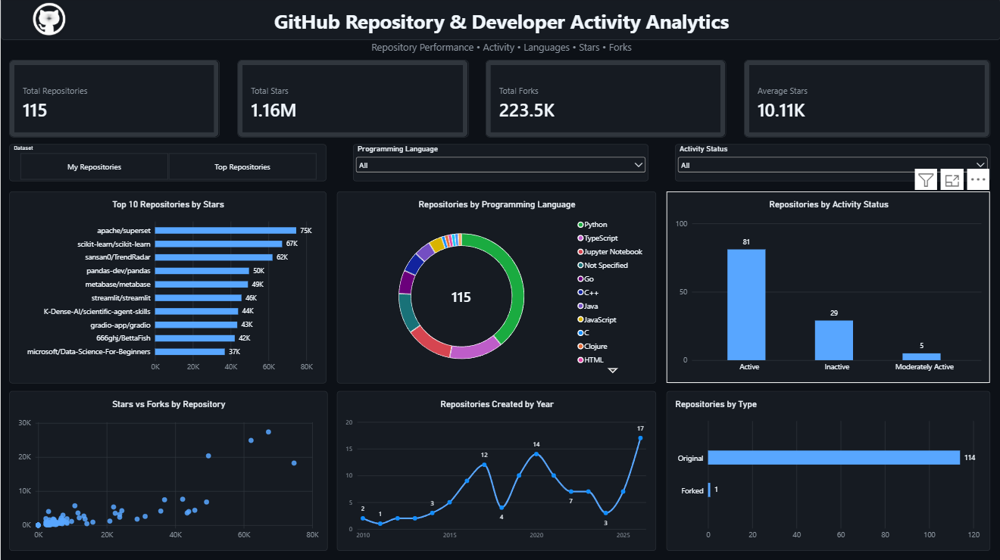

<div align="center">

# GitHub Repository & Developer Activity Analytics

### Turning repository metadata into clear, interactive insights

**Excel • SQL • Python • Power BI • Power Query • DAX**

A multi-tool analytics project exploring repository popularity, activity,
technology usage, growth patterns, and engagement across GitHub repositories.

</div>

---

## Project Snapshot

GitHub repositories generate more than code — they also contain useful signals
about project popularity, technology choices, maintenance activity, community
interest, and repository growth.

This project transforms repository-level GitHub data into an analytical workflow
that moves from **data preparation to interactive business intelligence**.

The analysis compares two perspectives:

| Dataset | Purpose |
|---|---|
| **My Repositories** | Understand the characteristics and activity of personal repositories |
| **Top Repositories** | Explore patterns among highly popular GitHub repositories |

The final result is an interactive **Power BI dashboard** supported by analysis
performed with Excel, SQL, and Python.

---

## Power BI Analytics Dashboard



The dashboard provides a single interactive view of repository performance,
popularity, activity, technology usage, and historical creation trends.

### Headline Metrics

**Total Repositories** • **Total Stars** • **Total Forks** • **Average Stars**

### Interactive Exploration

The report can be filtered dynamically by:

- Dataset
- Programming Language
- Activity Status

Selections also interact with the remaining visuals, allowing repository
patterns to be explored from multiple perspectives.

---

## Analytical Views

### Top 10 Repositories by Stars
Highlights repositories with the strongest star-based popularity.

### Programming Language Distribution
Explores how repositories are distributed across programming languages.

### Repository Activity Status
Separates repositories according to their current activity classification.

### Stars vs Forks
Provides a repository-level view of the relationship between stars and forks.

### Repository Creation Trend
Tracks repository creation across years to reveal development patterns over time.

### Repository Type
Compares original repositories with forked repositories where the information
is available.

---

## Analytics Workflow

```text
GitHub Repository Data
          │
          ▼
   Data Preparation
          │
          ├──── Excel
          ├──── SQL
          └──── Python
          │
          ▼
 Cleaning & Transformation
          │
          ▼
     Cleaned CSVs
          │
          ▼
      Power Query
          │
          ▼
    Unified Data Model
          │
          ▼
      DAX Measures
          │
          ▼
 Interactive Power BI Dashboard
          │
          ▼
   Analytical Insights
```

---

## Technology Stack

| Technology | Role in the Project |
|---|---|
| **Excel** | Data exploration and analytical preparation |
| **SQL** | Query-based repository analysis |
| **Python** | Cleaning, transformation and exploratory analysis |
| **Pandas** | Structured data manipulation |
| **NumPy** | Numerical analysis |
| **Matplotlib** | Exploratory visualizations |
| **Power Query** | Dataset transformation and integration |
| **DAX** | Dashboard metrics and KPI calculations |
| **Power BI** | Interactive analytics dashboard |
| **GitHub** | Project documentation and version control |

---

## Core Dashboard Measures

```DAX
Total Repositories =
COUNTROWS(Repositories)
```

```DAX
Total Stars =
SUM(Repositories[stars_count])
```

```DAX
Total Forks =
SUM(Repositories[forks_count])
```

```DAX
Average Stars =
AVERAGE(Repositories[stars_count])
```

These measures respond dynamically to report filters and visual interactions.

---

## Questions Explored

Rather than building charts independently, the project was structured around
analytical questions such as:

- Which repositories attract the most stars?
- How are stars and forks related across repositories?
- Which programming languages appear most frequently?
- How does repository activity vary across the dataset?
- How has repository creation changed over time?
- What proportion of repositories are original versus forked?
- How do personal repositories compare with the Top Repositories dataset?

---

## Dashboard Experience

The report was designed with a **GitHub-inspired dark interface** and focuses on
keeping analytical information easy to scan.

Key functionality includes:

- Dynamic KPI cards
- Dataset switching
- Programming language filtering
- Activity-status filtering
- Top-N repository analysis
- Cross-filtering between visuals
- Repository-level hover tooltips
- Interactive stars-versus-forks exploration
- Consistent dark-theme visual hierarchy

---

## Repository Structure

```text
GitHub-Developer-Activity-Analytics/
│
├── data/
│   ├── raw/
│   └── cleaned/
│
├── excel/
│
├── sql/
│
├── python/
│
├── powerbi/
│   └── GitHub_Developer_Activity_Analytics_Dashboard.pbix
│
├── screenshots/
│   └── powerbi_dashboard.png
│
└── README.md
```

---

## Key Takeaways

The analysis demonstrates that repository performance cannot be represented by
a single metric. Stars provide a signal of popularity, while forks indicate a
different form of engagement and reuse.

Programming language, activity status, repository age, and repository type add
additional context when interpreting repository performance.

The comparison between **My Repositories** and **Top Repositories** also creates
a useful benchmark for exploring how repository characteristics differ across
the two datasets.

---

## What This Project Demonstrates

This project showcases an end-to-end analytics workflow rather than only a
dashboard.

It demonstrates practical experience with:

**Data Preparation → SQL Analysis → Python EDA → Data Transformation →  
Data Modeling → DAX → Dashboard Design → Interactive Analysis**

---

## Future Scope

Potential extensions include GitHub API-based automated data collection,
scheduled refreshes, contributor analysis, commit activity, pull-request
analysis, issue tracking, and additional repository engagement metrics.

---

## Project Status

**Completed — End-to-End Data Analytics Project**

---

<div align="center">

### Built by Sakshi Panchal

**Aspiring Data Analyst**

If this project helped you explore GitHub analytics, consider starring the
repository.

</div>
